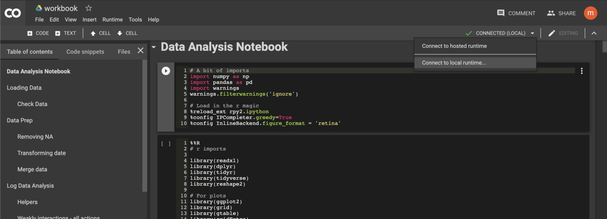
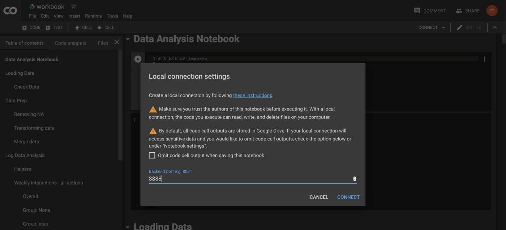

In case you want to use R and Python together using <a href="https://colab.research.google.com/">Google Colab</a>, below are the steps to follow. Please use `pip` rather than `pip3` if you are using `Python2`. 

Back in Jun 2019, I have posted a first version of this post on Medium <a href="https://medium.com/@ezzaouia/how-to-use-r-and-python-with-google-colaboratory-notebook-ebc4774d48a">here</a>. Now that I have my blog, I thought that it would be a good idea to give it a refresh here. This will pave the way for my follow up posts focusing on conducting statistical analytics using R and Python.

Without delving too much into the details, I just want to address the *why* aspects. One might tell: "R and Python are two different programming language, I can pick up one as I need. *Why bother using R and Python together in the first place?*" My humble answer to this question, is that I normally don't use them together unless there is a good reason to. These are my top three reasons that I find using R and Python together to be useful to me the most:

1. ***Complementarity***: Picking up focused library from both languages, such as `numpy`, `pandas`, `scikit-learn`, and such, from *`Python`* and `dplyr`, `ggplot2`, `lme4`, `psych`, and such, from *`R`*
1. ***Being Task-centric***:  Both languages carry forth a unique approach. `Python`: *programming*-oriented, `R`: *statistical*-oriented, combining them help maintain the focus on the task
1. ***Learning and Recall***: Keeping hands in/on the two most popular programming languages ​​for data analysis

## Setup instructions

### Step 1: Install `Jupyter`

One way to install `Jupyter` on your local machine is via `pip` or `pip3` —depending on the version of `Python` you are using. 

```bash
pip3 install jupyterlab
```

**If needed**, refer to <a href="https://jupyter.org/install" target="_blank">Jupyter</a>'s installation guide for more detail.

### Step 2: Download and Install `R`

The simplest way to get `R` up and running on your local machine is by downloading and installing the latest release from this <a href="https://cloud.r-project.org/" target="_blank">page</a> on R-Project.org.

 **If needed**, refer to <a href="https://www.datacamp.com/community/tutorials/installing-R-windows-mac-ubuntu" target="_blank">Datacomp</a>'s installation guide for more detail.


### Step 3: Install `jupyter_http_over_ws`

This will enable `google colab` to use `Jupyter` notebook running in our local machine, i.e., `localhost`, using WebSocket rather than HTTP, because of cross-domain communication barriers.

```bash
pip3 install jupyter_http_over_ws
```

**If needed**, refer to the extension's <a href="https://github.com/googlecolab/jupyter_http_over_ws" target="_blank">github page</a> for more detail.

### Step 4: Enable `jupyter_http_over_ws`

```bash
jupyter serverextension enable --py jupyter_http_over_ws
```

### Step 5: Install `rpy2`

This is how the magic happens. To put it simple, `rpy2` will allow/handle the communication between `R` and `Python`, this includes many things, among which, loading `R` libraries into a `Python` environment, import data from R into Python and vice-versa, and so on.

```bash
pip3 install rpy2
```

### Step 6: Start `Jupyter` server and authenticate

```bash
jupyter notebook \
  --NotebookApp.allow_origin='https://colab.research.google.com' \
  --port=8888 \
  --NotebookApp.port_retries=0
```

### Step 5: Connect to `Jupyter` from `Colab`





## Execute/Share `R` and `Python` code

### Step 1: Load `R` 

```Python
%reload_ext rpy2.ipython
```

See an example in this <a href="https://colab.research.google.com/drive/1yGG0Cu1o48gvtjYSri2K7XhwnaN_nBCR#scrollTo=UVVpb5RvAOBM&line=8&uniqifier=1" target="_blank">google colab cell</a>.

### Step 2: Run R 

```Python
%%R # this need to be topmost in a cell

# R imports..
library(ggplot2)
```
See an example in this <a href="https://colab.research.google.com/drive/1yGG0Cu1o48gvtjYSri2K7XhwnaN_nBCR#scrollTo=-BZSpj49AoqB&line=4&uniqifier=1" target="_blank">google colab cell</a>.


### Step 3: Import data from R into Python 

```Python
%R -o df1 -o df2 # this need to be topmost in a cell
```

See an example in this <a href="https://colab.research.google.com/drive/1yGG0Cu1o48gvtjYSri2K7XhwnaN_nBCR#scrollTo=Gu6aSZELBfxT" target="_blank">google colab cell</a>.

### Step 4: Import data from Python into R 

```Python
%R -i df3 -i df4 # this need to be topmost in a cell
```

See an example in this <a href="https://colab.research.google.com/drive/1yGG0Cu1o48gvtjYSri2K7XhwnaN_nBCR#scrollTo=ChrblhUVCV6P" target="_blank">google colab cell</a>.
