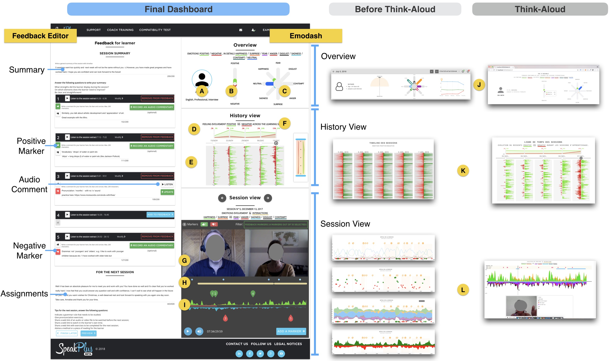

> _A teacher who recognizes an individual student’s emotions, understands the cognitive appraisals that may be associated with these emotions, and how these cognitions and emotions motivate the student’s behavior can effectively respond to the student’s individual needs._ <br/>
> [@Jennings2009Prosocial, p. 493]

## 🖐️ The big picture
This paper is a follow up to [our paper](/papers/multimodal-emotions-awareness-in-online-learning/) on multimodal emotions awareness. Emotional awareness plays an important role in multiple parts of learning settings. However, they are harder to develop in video-conferencing environments due to technology-mediated interactions, technical challenges, and teachers’ main focus on properly conducting learning activities.

>*Do emotion awareness dashboards have an effect on the type of teachers' feedback?*

To examine this question, we built upon our previous case study and adopted an iterative design process in which we interviewed five teachers and collaborated with a pedagogical manager, a language researcher, and two teachers. During the design, we conducted two formal formative evaluations leading to the design of Emodash. We conducted a two-month in-the-wild field study with five teacher-learner pairs, to examine how Emodash supports teachers' retrospective awareness of learners' emotions in online learning and how it impacts feedback reports that teachers write to learners after each learning session.

The results showed that Emodash led teachers to write significantly more affective and formative feedback as well as less summative feedback, suggesting a stronger awareness of learners' emotions. Furthermore, our results suggest that glanceable visualizations of learners’ emotions may be preferred and sufficient to foster teachers’ awareness of learners’ emotions. Finally, the dashboard led teachers to reflect on the way they conduct their lessons, using learners' emotions as a proxy to evaluate their conduct of teaching.



## Highlights

- Emodash, a dashboard designed based on interviews with five teachers and one learner and refined via an iterative design process, to facilitate teachers' retrospective awareness of learners' emotions, and support teachers' writing of reinforcement feedback reports to learners after video-conferencing language learning sessions.
- An in-the-wild field study of Emodash. This study extends our understanding of how emotional dashboards support retrospective awareness of learners' emotions in a video-conferencing language learning environment.
- A qualitative and quantitative study comparing teachers' written feedback reports under two conditions _with_ and _without_ Emodash.
- Emodash led teachers to write significantly more formative and less summative feedback reports than without the dashboard.
- Emodash led teachers to write significantly more affective feedback reports than without the dashboard.
Visualizing learners’ emotions led to an increase in teachers self-awareness and reflection.

## BibTeX Citation
```jsx
@article{Ezzaouia_IJHCS2020_Emodash,
	journal = {International Journal of Human-Computer Studies},
	doi = {https://doi.org/10.1016/j.ijhcs.2020.102411},
	issn = {1071-5819},
	title = {Emodash: A dashboard supporting retrospective awareness of emotions in online learning},
	url = {http://www.sciencedirect.com/science/article/pii/S1071581918305585},
	volume = {139},
	author = {Ez-zaouia, Mohamed and Tabard, Aurélien and Lavoué, Elise},
	pages = {102411},
	date = {2020},
	year = {2020},
}
```

## Preprint Paper

Emodash: a Dashboard Supporting Retrospective Awareness of Emotions in Online Learning.
<a href="./Ezzaouia_IJHCS2020_Emodash.pdf" target="_blank">Download a pdf</a>.

@@bibliography