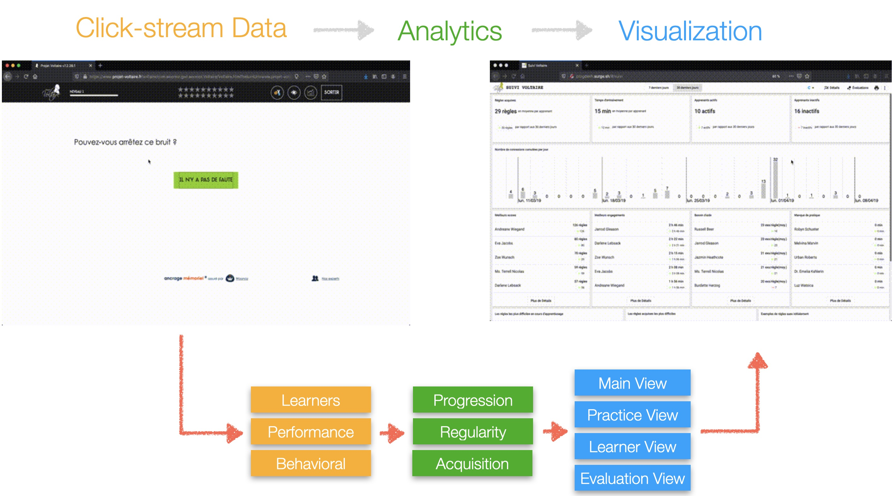
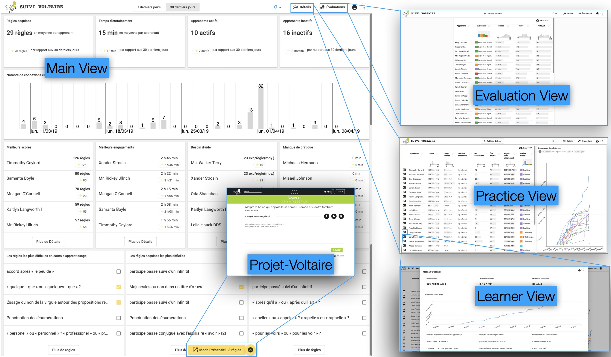

> _Visible teaching and learning occurs when there is deliberate practice aimed at attaining mastery of the goal, when there is feedback given and sought, and when there are active, passion- ate, and engaging people (teacher, students, peers) participating in the act of learning. [...] What does matter is teachers having a mind frame in which they see it as their role to evaluate their effect on learning._ <br/>
> <cite>Hattie, 2012, p. 53:55[^Hattie]</cite>

[^Hattie]:
  Hattie, John (Mar. 2012). Visible Learning for Teachers. Routledge. doi: <a href="https://doi.org/10.4324/9780203181522" target="_blank"><small>10.4324/9780203181522</small></a>

## 🖐️ The big picture

Schools are increasingly integrating web-based learning environments with in-class learning activities. Teachers leverage these platforms, to support in-class learning, help learners develop skill-sets that should already be mastered, or to provide personalized support to learners with specific needs, e.g., dyslexics. Teachers blending in-class and remote online learning activities carry forth numerous challenges in monitoring learners’ online activity and progress, especially to inform in-class pedagogical interventions.

>*Do learning progression dashboards inform teachers' pedagogical practices?*

We examined this question in the setting of <a href="https://projet-voltaire.fr" target="_blank">Projet-Voltaire</a> which is an online learning platform dedicated to learning French vocabulary, grammar, and spelling concepts. Teachers use Projet-Voltaire to level up the writing skills of learners. Teachers using Projet-Voltaire face one main challenge: lack of fine-grained feedback about learners’ interactions with online learning materials to inform pedagogical interventions. We conducted a design study of Progdash, a dashboard providing teachers with fine-grained feedback about learners’ progression. We designed Progdash based on interviews with seven teachers to understand their needs and collaboratively iterate on design prototypes. We implemented and integrated Progdash in Projet-Voltaire. We conducted a three months-long field study with 29 teachers collecting logs, diaries, and interview data to evaluate how Progdash informed their practices. 

Our findings extended prior work on teachers’ practices using dashboards. Teachers found Progdash actionable to devise informed pedagogical practices: monitoring, conducting assessments, planning interventions, sharing in-class, providing debriefing and feedback. Based on our findings we suggest directions for dashboards to effectively support teachers in schools using online learning platforms.






## Highlights

- A design study of Progdash, a dashboard designed based on interviews with seven teachers and refined through collaborative design prototypes, to bridge between learners’ use of an online grammar learning platform and teachers’ data-informed pedagogical practices.
- An in-the-wild field study of Progdash. This study extends our understanding of how teachers integrate a dashboard in their practices to articulate remote and in-class learning.
- Teachers found Progdash actionable to devise informed pedagogical practices: monitoring, conducting assessments, planning interventions, sharing in-class, providing debriefing and feedback.
- Design implications for dashboards to bridge online and in-class learning and facilitate data-informed pedagogical practices.

## BibTeX Citation
```jsx
@article{Ezzaouia_CSEDU2020_Progdash,
  title= "Progdash: Lessons Learned From a Learning Dashboard in-the-wild",
  author="Ez-zaouia, Mohamed and Tabard, Aur{\'e}lien and Lavou{\'e}, Elise",
  booktitle= "Proceedings of the 12th International Conference on Computer Supported Education - Volume 2: CSEDU",
  year = "2020",
  pages = "105--117",
  publisher = "SciTePress",
  organization = "INSTICC",
  doi = "10.5220/0009424801050117",
  isbn = "978-989-758-417-6",
  note = "Best Industrial Paper Award"
}
```

## Preprint Paper

Progdash: Lessons Learned From a Learning Dashboard in-the-wild.
<a href="./Ezzaouia_CSEDU2020_Progdash.pdf" target="_blank">Download a pdf</a>.
