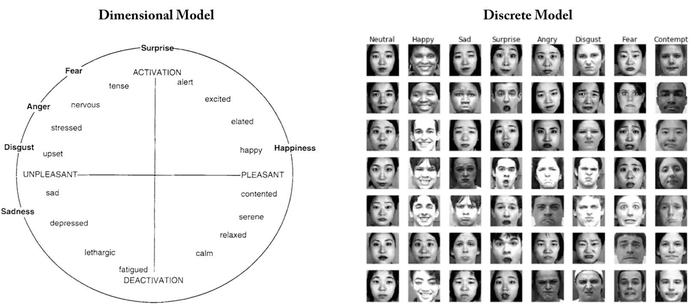
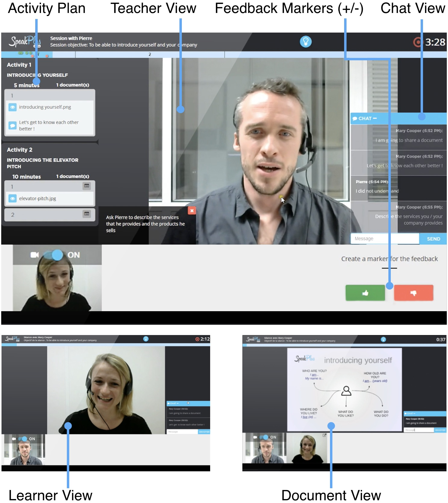
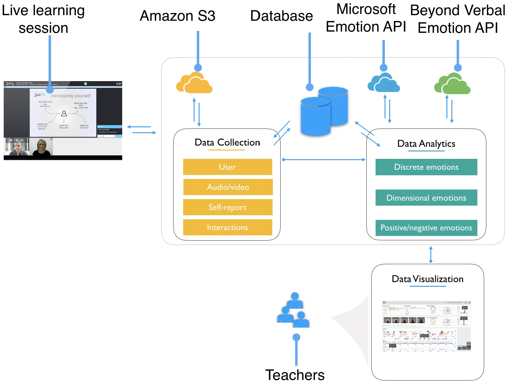

> _Not all computers need to pay attention to emotions, or to have emotional abilities. Some machines are useful as rigid tools, and it is fine to keep them that way. However, there are situations where the human-machine interaction could be improved by having machines naturally adapt to their users, and where communication about when, where, how, and how important it is to adapt involves emotional information, possibly including expressions of frustration, confusion, disliking, interest, and more._ <br/>
> [@Picard1999AffectiveForHCI]

## 🖐️ The big picture
Emotion plays an important role in learning experiences, processes, and outcomes.
Capturing emotional _awareness cues_ about learners and making them available to teachers may prove useful in fostering sustainable socio-affective relationships. Such an enterprise, is, however, challenging given the complex nature of human emotions; it would be more complete to rely on different modalities to capture, quantify, and integrate cues about learners' emotional states.

>_Can we support multimodal emotional awareness in online learning?_

To examine this question in the setting of  in the setting of SpeakPlus[^SpeakPlus] —see figure below, which is a video-conferencing platform dedicated to improving oral communication skills in a foreign language, i.e., English, French, and Spanish. Teachers use SpeakPlus to deliver virtual live classes to learners. We conducted a case study investigating a multimodal approach, i.e., applying two theoretical models of emotion: discrete and dimensional —see figure below*[^EModels], and for using commercial cloud APIs for emotion recognition when inferring learners' emotions in online learning environments. We demonstrated this approach in the context of SpeakPlus through the use of audio and video streams when inferring automated emotions along with learners' self-reported emotions, as well as contextual teachers' and learners' interaction traces on the platform.

[^SpeakPlus]:
  SpeakPlus was a raising startup launched in 2014 by two the co-founders <a href="https://www.linkedin.com/in/cirojaenpaniza/" target="_blank">Ciro</a> and <a href="https://www.linkedin.com/in/xavierbarry/" target="_blank">Xavier</a>. The startup operated from 2014 to 2017. Unfortunately, it shut down in late 2017.




[^EModels]:
  Facial expression from CK+ & Jaffe datasets.

In addition to proving the feasibility of using cloud APIs for emotion recognition in online learning environments, we analyze 10 learning sessions of 45 minutes each —more than 7 hours' recording in total, to compare emotions from two modalities: audio and video.
We propose an approach for combining discrete and dimensional emotional cues to capture learners' emotional states. Our findings —of a pilot study with two teachers, highlight the pertinence of the multimodal approach for inferring emotion in distance learning, where, in particular, different emotions are detected from different sources, i.e., audio and video, during such settings.





## Highlights

- A case study of using heterogeneous APIs when inferring automated emotional awareness cues of learners' emotions from  audio and video alongside self-reported emotions and contextual users' interaction traces in online/distance learning.
- A method for unifying discrete and dimensional models of emotions.
- A qualitative and quantitative exploratory analysis comparing learners' inferred emotions from audio and video.

## BibTeX Citation
```jsx
@inproceedings{Ezzaouia2017Emoda,
	series = {LAK '17},
	journal = {Proceedings of the Seventh International Learning Analytics &Knowledge Conference},
	doi = {10.1145/3027385.3027434},
	isbn = {978-1-4503-4870-6},
	numpages = {10},
	publisher = {ACM},
	address = {Vancouver, British Columbia, Canada},
	title = {{{EMODA}}: {{A}} Tutor Oriented Multimodal and Contextual Emotional Dashboard},
	author = {Ez-zaouia, Mohamed and Lavoué, Elise},
	pages = {429--438},
	date = {2017},
	year = {2017},
}
```

## Preprint Paper
EMODA: A Tutor Oriented Multimodal and Contextual Emotional Dashboard.
<a href="./Ezzaouia_LAK2017_Emoda.pdf" target="_blank">Download a pdf</a>.

@@bibliography