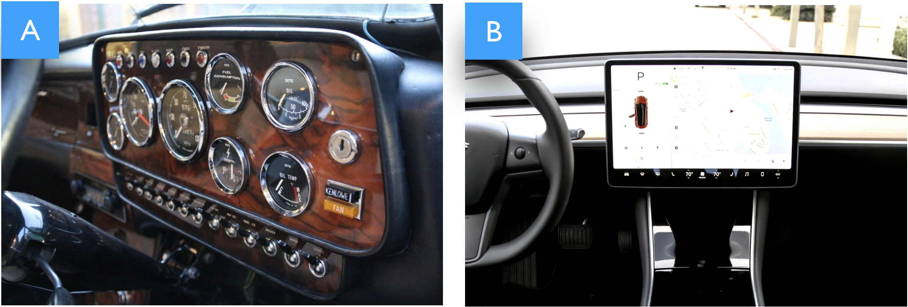

> *Dashboards can tap into the tremendous power of visual perception to
> communicate, but only if those who implement them understand visual perception
> and apply that understanding through design principles and practices that are
> aligned with the way people see and think. Software won't do this for you.
> It's up to you* [@Few2006InformationDashDesign, p. 12].

## Overview

In this dissertation, we investigate the design and use of teachers' dashboards
to inform pedagogical practices when assisting learners in using online learning
platforms. We seek specifically to extend our understanding of not only what
teachers are supposed to do or can do with dashboards, but more importantly what
they actually *do* with them in everyday practice, along with sociotechnical
factors, pedagogical practices, and the design challenges that such tools
underpin. We build upon a large body of research from different fields,
including social science, human-computer interaction, human-centered design,
information visualization, learning analytics, and the wider technology-enhanced
learning domains, to name but a few.

In this chapter, we structure and discuss related works in six main themes
relevant to this dissertation:

1.  **Introducing Information Dashboards**: In this section, we place the work
    conducted for this dissertation in the context of information-driven
    dashboards. In particular, we emphasize the most interesting and challenging
    features of dashboards, such as visual encoding, different contexts of use,
    different audiences, glanceable readings.

2.  **Introducing Learning Analytics**: In this section, we introduce the field
    of learning analytics. We place particular emphasis on harnessing learning
    data to improve teaching and learning experiences and outcomes through the
    use of information-driven tools and visualizations when leveraging human
    informed judgment.

3.  **Monitoring Learners' Activity**: In this section, we focus on research
    into teacher-facing dashboards aimed at supporting monitoring of learners'
    activity when using online learning materials. We organize and discuss
    research in this area in three main themes: proactive monitoring, classroom
    monitoring, and retrospective monitoring.

4.  **Fostering Sociotechnical Factors**: In this section, we focus on research
    into fostering sociotechnical factors through the use of teacher-facing
    dashboards, particularly highlighting how dashboards can go beyond log-based
    measurable metrics and features by fostering important human factors, such
    as data sense-making, awareness, socio-affective relationships, and
    reflection, when using learning dashboards.

5.  **Evaluating Teachers' Dashboards**: In this section, we focus on methods
    adopted when evaluating teachers' dashboards. In particular, we organize and
    discuss empirical studies in two main themes: usability and usefulness
    oriented evaluations, as well as pedagogical practice-oriented evaluations.

6.  **Dashboard Design and Use**: Taking a top-down approach, in this section,
    we discuss work on teachers' dashboard design and use from a methodological
    perspective.

## Introducing Information Dashboards

Before describing and discussing some interesting features which merit in-depth
study and research, of _dashboards_ in informatics or, as we know and use them
nowadays, the etymology of the word "dashboard" also provides some noteworthy
facts.

### Origin —Enabling Drivers to See Along and Ahead

The main strand of the origin of the term "dash-board" can be rooted in motive
(and motion), around 5,000 years ago or, more specifically, to the human-horse
relationship [@Damgaardeaar7711HumanHorse], which was a key turning point in
revolutionizing not only transport but the world as we know it today. Although
the solid disk wheel was first invented way before domestication of the horse,
in the fairly early Bronze age, it was only in the middle Bronze era that Bronze
age inventors put together the chariot: a box on top of wheels. This invention
opened up immense opportunities for human travel and carriage.

Interestingly, the use of the term "dashboard" originates from the jargon of the
horse-drawn carriage. Way back then, as Figure [1](#horse-dashboard) portrays,
since most routes were not paved, people came up with the idea of placing a
_board_ ("screen") made of wood or leather which they called "dashboard", on the
forepart of the horse-drawn open carriage to *"stop \[prevent\] mud from being
splashed \["dashed"\] into the vehicle by the horse's
hooves"* [@EtymonlineDashboard]. The _tool_ was designed to intercept dirt so to
protect the vehicle and its passengers, and by doing so the dashboard freed the
_riders_ ("drivers") from distractions to enable them to focus and see
("monitor") the route along and ahead.

 Figure
<a id="horse-dashboard" href="#horse-dashboard">1</a>: Example of a horse-drawn
carriage "dashboard". The tool is designed to protect the driver and passengers
by catching dirt, dust, and debris thrown up by the horse's hooves. A salient
function of the tool is to free the rider from distractions so s/he can see the
route along and ahead.

Moving from the horse-drawn carriage to much more modern auto-motives, see cars,
dashboards have retained not only the name but also their focal place and
function. As Figure [2](#car-dashboard) portrays, during this evolution,
dashboards have evolved from a simple wooden or leather static object in front
of the rider to a board *"on which control panels and gauges are
mounted"* [@EtymonlineDashboard] to enable drivers to best monitor the status of
the vehicle and control its behavior. Over time dashboards have gained an
essential role in the history of monitoring by providing drivers and passengers
with formative, quality, and safety ensuring metrics.

 Figure
<a id="car-dashboard" href="#car-dashboard">2</a>: On the left (A) is an example
of an old Mini Cooper 1275-S-Mk3 car's dashboard. This dashboard presents
critical status information, using gauges for, e.g., speed, fuel, oil, water;
color-coded flags; buttons; also, the information is structured on the layout to
facilitate glanceable readings, for instance, important metrics are scaled up
and placed in the center to best match the viewport of the driver almost all the
ingredients of a digital dashboard. On the right (B) is an example of a Tesla
model S car's dashboard. This dashboard portrays a nice joining between the
car's dashboard and an information-driven digital tool for monitoring and
controlling the car.

### Raise —Supporting Data-driven Business Decisions

It took only 10 years for dashboards from the first distributed message
communicated over ARPAnet in 1969s, to pass across cars to computers.
Figure [2](#car-dashboard) portrays a nice joining between a car's dashboard and
a digital one: for instance, the Tesla model S dashboard features a full
data-driven monitoring digital tool for the whole car. Digital dashboards, as we
now use them, first emerged in the 1980s with executive information systems
(EISs) summarizing key status measurements, gathered from corporate internal and
external resources, and displayed via a simple user interface so that *"even an
executive could understand"* [@Few2006InformationDashDesign, p. 14], to support
data-driven decision-making and communication of information within and across
corporate departments [@creps1994executive].

Follow-up work, during the 1990s, focused on the technical aspects of
collecting, storing, and processing data, building the infrastructure required
for a new field: online analytical processing (OLAP). During this period, the
focus on business analytics and business intelligence resulted in the raise of
key performance indicators (KPIs) dashboards [@Kaplan1992BalancedScore] as
effective tools to monitor and assess system performance.

Over time, information dashboards have evolved as types of information
visualization to more sophisticated information portals, enabling users to make
use and sense of data, to inform work, decisions, and
practice [@Sarikaya2018DahsboardDesignSpace]. However, dashboards have retained
their main role inherited from car dashboards: in particular, a small appealing
board that hides the immense complexity of the underlying system by probing key
formative, quality, and safety ensuring metrics, presenting critical information
to enable at-a-glance readings, and shaping the presentation to fit a wide range
of audiences.

### Formation —Key Features of Information Dashboards

In 2006, Stephan Few proposed one of the first working definitions of an
information dashboard as: *"a visual display of the most important information
needed to achieve one or more objectives consolidated on a single screen so it
can be monitored and understood at a glance"* [@Few2006InformationDashDesign, p. 26]. Few's definition entails what makes dashboard design interesting and
challenging at the same time: easy-to-read, understand, and make sense and use
of large, complex, critical amounts of information at-a-glance. To that end,
dashboards leverage different key features:

 Figure <a id="spreadsheet-dashboard" href="#spreadsheet-dashboard">3</a>: Example of a dashboard emphasizing raw learning data through visual encoding Progdash —[@Ezzaouia2020Progdash].

Dashboards **emphasize visual encoding**. As
Figure [3](#spreadsheet-dashboard) portrays, data visualization
is at the heart of dashboard design and use. Data in dashboards are abstracted
using verbals text, numbers, and graphics, but with more emphasis on graphics so
as to capitalize on human perceptual and cognitive abilities for processing
visual information. To that end, along with verbals and numbers, data need to be
mapped effectively to graphical elements and
properties [@Cleveland1984VisEncodingPerception]. Point, line, surface, and
volume are the basic graphical elements that can be used and combined to create
visual forms. Position, size, color, orientation, texture, and shape are
graphical properties that can be used to decorate visual forms.

Dashboards **put forth glanceable readings**. This is important as the essence
of dashboards is to emphasize key indicators by compacting the required all
related and relevant, information in a small amount of visual space to inform
the audience in a meaningful, efficient, and actionable way at-a-glance. A
dashboard serves its purpose well when it fits into a single screen, that is,
viewers do not have to scroll or switch between different screens to grasp the
needed information. In the former case , we exceed the viewport of the viewer by
expanding the boundaries of the dashboard; and in the latter case , we fragment
the information and perhaps its context too. In both cases, we hamper the
perceptual and communicative intent of the dashboard.

 Figure <a id="dashboard-drill-down" href="#dashboard-drill-down">4</a>: Overview, detail on demand
[@Few2013InformationGlance].

Dashboards **facilitate drilling up and down**. Few's definition can be seen as
restrictive as it requires a dashboard to fit a single
display [@Few2006InformationDashDesign]. However, Few's definition aims at
overcoming poor dashboard design by delivering the _needed_ information in a way
to catch viewers' attention at a first glance. As
Figure [4](#dashboard-drill-down) portrays, dashboards
build fundamentally upon the mantra: *"overview first, zoom and filter, then
details on demand"* [@Shneiderman2003]. In the overview: viewers get the
intended message directly at-a-glance without overwhelming actions or
distractions. Interaction methods can then be used to let the viewer examine in
more detail specific aspects and different levels of data presented on the
dashboard. This can be achieved through navigation and drilling up and down.

Dashboards **fit a wide range of audience**. Dashboard simplicity is intentional
to support a wide range of different users with different data, visuals, and
analytic literacy. That is, users can interact with dashboards through
aggregation, filtering, searching, drilling up and down to make use and sense of
the information presented [@Sarikaya2018DahsboardDesignSpace]. However, unlike
visual analytics, dashboards do not require end users to engage in active
analytical interaction with data, for example, to explore and confirm
hypotheses, categorize and identify interesting features of data for further
examination [@Vieira2018VisualLearningAnalytics; @thomas2006visual].

Dashboards **leverage human informed judgment**. As information-driven tools,
design and use of dashboards are, importantly, both: "open" and "slow".
Dashboards are open in the sense of their informative design, while they are
slow as they are not primarily designed to do things "fast" or to perform
productivity. Instead their use is more tailored to foster data sense-making,
hence, falling into what is known as the slow category
technology [@Hallnas2001SlowTech]. As such, dashboards aim at leveraging human
perceptual and cognitive abilities of processing information to help users
visually explore data of interest, reason about and make sense of what they see,
help guide them towards effective informed decisions, actions, learning,
communication, awareness, and reflection [@Brath2004DashDesign;
@Sarikaya2018DahsboardDesignSpace].

### Adoption —Facilitating Data-driven of Everyday Practices

Dashboards are now widespread in society. Their interesting features,
highlighted above, make them promising tools for harnessing data to support
different day-to-day practices for
non-experts [@Sarikaya2018DahsboardDesignSpace]. Academia is not exception when
adopting information dashboards. Schools tend most to lower barriers for
teachers' adoption of technology for their classrooms [@TeacherDigitalClassroom;
@TeachersTechAdoption; @DigitalClassroomMarket]. Recently, for instance, 71% of
surveyed faculties were willing to adopt online materials if they are of high
quality and affordable [@OnlineLearningConsortium]. However, education
technology is not without limitations or drawbacks, a problem that has not gone
unnoticed by researchers.

In fact, the increased mixing of digital and traditional classrooms has
highlighted several challenges for making technology work to its best in
everyday learning. For example, understanding learners' state of learning online
and devising informed interventions to best engage, coach, and support them when
using online learning materials continue to be some of the major issues facing
this learning medium [@Onah2014DropoutPatterns; @Lee2010DropoutReview].
Fortunately, use of technology yields important streams of traces that can
provide valuable insights if captured and made available to underlying users.

By early 2000, formal data-driven approaches to support informed decisions,
assessments, and communication were finding their way in educational contexts,
with the goal of harnessing and learning from generated and collected data. The
line of reasoning is, in part, to improve teaching and learning outcomes by
providing meaningful and actionable data-informed insights to the underlying
stakeholders, such as teachers, learners, advisors, administrative staff
members, and course designers [@siemens2011LA]. Also, in part, a more
longitudinal and holistic ambition is actually to understand learners'
behaviors, interactions, progress, and process, to provide continuous knowledge
about learners' state of learning and skills, and to transfer knowledge from one
session to another, from grade to grade, and from one setting to
another [@Siemens2012EDMAndLA].

## Introducing Learning Analytics

*"The data flood is here! Traditional methods of data analysis have not kept
pace with the amount of data that can be collected and is being collected from
educational environments today."* [@Baker2012Panel, p. 2].

Schools are increasingly deploying learning management systems to deliver course
contents online [@Paulsen2003LMS]. Self-paced learning environments and
intelligent tutoring systems are also becoming popular in
classrooms [@Adkins2018GamebasedLearning; @Mamun2016SelfPaced; @Kulik2015ITS].
Moreover, massive open online course platforms, e.g.,
[Edx](https://www.edx.org/), [Coursera](https://www.coursera.org/),
[Khan Academy](https://www.khanacademy.org/), as well as paid ones, e.g.,
[Udacity](https://udacity.com/), [Udemy](https://www.udemy.com/),
[Lynda](https://www.lynda.com/) are being increasingly adopted by leaners for
both formal and non-formal education and training [@Crues2018MOOC]. Learners
step through different materials on such platforms, leaving behind important
learning traces stored on a daily basis by server logs, which can provide
valuable insights into learners' behaviors, process, progress, and skills.

The blending of classrooms with digital learning tools and materials, as well as
the resulting challenges of harnessing technology to best fit a complex learning
and teaching environment, led to the increase in education data-analytics.
Research fields, such as Educational Data Mining and Learning Analytics and
Knowledge, emerged. The international society of educational data-mining defines
this field as: *"an emerging discipline, concerned with developing methods for
exploring the unique types of data that come from educational settings, and
using those methods to better understand learners, and the settings which they
learn in"* [@siemens2011LA]. Siemens et al., defined the field of learning
analytics as: *"the measurement, collection, analysis and reporting of data
about learners and their contexts, for purposes of understanding and optimizing
learning and the environments in which it occurs"* [@siemens2011LA].

The overview of the work of education data-analytics communities is structured
around: the _what_, e.g., data, environments; _why_, e.g., monitoring, analysis,
prediction, intervention, tutoring, mentoring, assessment, feedback,
recommendation; _who_, e.g., learner, teacher, advisor, course designer; _how_,
e.g., statistics, data mining, machine learning,
visualizations [@Chatti2012LAModel; @PeaAyala2018LATaxonomy]. Although both
educational data-mining and learning analytics communities work towards
improving learning and teaching by assessing data, it is worth noting that they
have different approaches, i.e., in terms of _why_ and _how_, for achieving
these shared objectives. The key distinction is that the former places _"greater
focus on automated discovery"_, i.e., focuses on methods for making and
automating discoveries, while the latter places _"greater focus on leveraging
human judgment"_ through reporting tools and
visualizations [@Siemens2012EDMAndLA], i.e., focuses on the process of
collecting, analyzing, measuring, and reporting insights to help underlying
stakeholders make use and sense of data, and guide them in making informed
decisions.

### Harnessing Learning Data

Learning analytics rely on data or, more specifically, learning traces
timestamped click-stream logs, and other learners' related data bodily signals,
self-reported data, grading etc., to improve teaching and learning. For example,
learners' use of learning management systems results in collecting large amounts
of data about learners' actions, quiz completions, learning
artifacts [@Paulsen2003LMS]. Enrollment into massive online courses leads to
collecting demographic information, action logs about video and exercise
navigation, quiz performance, forum discussions [@Crues2018MOOC]. Similarly, the
increase in self-paced learning environments results in collecting learners'
actions, errors, struggles, attempts, moments of
idle [@Adkins2018GamebasedLearning; @Mamun2016SelfPaced].

Given the complex nature of learning and teaching, often it is difficult or
insufficient to rely on one modality, e.g., logs, to provide insights into
learners' states of learning. One of the ambitious goals of learning communities
is to collect and use different modalities also referred to as multimodal
analytics, such as using video, audio, gestures, emotions, logs, cognition
loads, among others, to characterize, design, and study learning and teaching in
a holistic way [@Worsley2018MMLA].

In the same way, such modalities are often longitudinal with longer time frames,
and are complex and heterogeneous, thus making it difficult to mine for utility
purposes using traditional methods and tools, e.g., spreadsheets. Furthermore,
teachers, learners, and school staff members face barriers when using data in
their workplaces by themselves, including a lack of time [@TeachersAndData;
@Sandford2006TeachingWGLoT] and data, visual, and analytic literacy to process,
analyze, and make sense and use of data [@Wasson2016TeacherDataLiteracy]. There
is thus a growing need for methods and tools that facilitate "translation" of
learning data into actionable insights for non-experts.

Learning communities work towards building reliable methods, models, techniques,
and tools to harness data for critical value [@Chatti2012LAModel;
@Baker2014EDMAndLA]; starting by capturing and preparing learning traces into
usable forms [@Kandel2011DataWrangling]; summarizing and transforming usable
traces into insightful indicators [@Sarikaya2018SummaryVis]; then encoding those
indicators into meaningful visual representations to support information-driven
practices in teaching and learning
settings [@Vieira2018VisualLearningAnalytics].

### Leveraging Teachers and Learners Judgment

One of the key focuses of the learning community is _"leveraging human
judgment"_ through data-driven approaches and tools [@Siemens2012EDMAndLA]. The
globalization of dashboards and their interesting features: emphasizing key
formative, quality, and safety ensuring metrics, glanceable readings, wide
audience fitting [@Sarikaya2018DahsboardDesignSpace], caught the interest of
learning communities to investigate them when facilitating different kinds of
information-driven applications, such as monitoring, regulation, awareness,
reflection, learning, collaboration, and more [@Chatti2012LAModel;
@Vieira2018VisualLearningAnalytics].

In education settings, information-driven tools are roughly inspired by two
approaches, namely "quantified-self" and "data-analytics". In quantified-self,
for instance, in health-care, users collect data on their own life's habits,
e.g., diet, workout, sleep; and visualizations are used to help users' make use
and sense of data and facilitate self-awareness and self-reflection. Most
learning dashboards, inspired by quantified-self, are
learner-centered [@Bodily2018LADashReview; @Jivet2017LADScience], with the goal
of facilitating self-monitoring, awareness, reflection, and
metacognition [@Duval2011LAVis; @Loboda2014MasterGrid; @Ruiz2016EmotionDash].

The data-analytics approach, on the other hand, considers that teaching and
learning are complex internal processes that need to be formally informed using
systematic approaches. For instance, when a teacher opts for an existing
learning material or activity or updates it, how is the learning really
improved, and how can such improvements best be assessed? The analytical
approach aims at filling this gap by leveraging formative assessment and
data-driven decision support through teacher-centered
dashboards [@Black1998FormativeAssessment; @Wayman2005TeacherDataUse;
@SEDRAKYAN2019DashLinkVis]. Both movements, learner-centered and
teacher-centered, have different approaches for collecting, analyzing, and
designing visualizations to assist teachers and learners in emphasizing
indicators about "what is doing on" to improve teaching and learning experiences
and outcomes.

### Teachers' Dashboards

When drawing a parallel with traditional learning, for instance, in
face-to-face, teachers frequently track and assess different cues about
learners, such as participation, social and behavioral interactions, or engage
directly with learners in discussions to assess their understanding and
involvement with learning activities. Such cues make the state of learning
_visible_ for a teacher to devise informed interventions. In online learning,
teachers and learners lack natural cues, such as gestures, facial expressions,
direct contact, dialog with and feedback from others. Dashboards can compensate
such vital cues of a shared context.

Ever since the increase in data-driven learning communities, dashboards have
been at the forefront of digital tools, when harnessing learning traces and
other learners' related data, to improve learning and teaching. _Teachers'
dashboards_ are a type of information dashboards [@Few2004DashConfusion;
@Sarikaya2018DahsboardDesignSpace; @Smith2013DashResearchCom] aimed at
processing, summarizing and presenting meaningful, informative, quality, and
safety ensuring indicators about state of learning to teachers. The simplicity
of dashboard design and use, visual encoding, easy-to-read, glanceable readings,
wide audience fitting, makes them a good fit when instrumenting teachers to
allow in-time informed pedagogical interventions.

Early work on learning dashboards focused on instrumenting teachers with
data-driven tools to support formative assessments and
accountability [@Black1998FormativeAssessment; @Wayman2005TeacherDataUse].
Follow-up research focused on leveraging teachers' judgment through reporting
tools and visualizations [@Siemens2012EDMAndLA; @Verbert2014DashboardsReview].
Recently, a wide range of teachers' dashboard contributions has been introduced
spanning a variety of aspects.

### Summary Notes

The research into dashboards could be seen as having an ambivalent audience,
roles, and applications in education setting literature [see a
review, @Schwendimann2017DashReview]. Specifically, in terms of "audience",
such work can be grouped into two separate, but partially overlapping, strands.

The first strand is driven by theories and studies advocating a shift in the
focus from the teacher to learners, namely constructivism in both cases:
cognitive or individual informed by Piaget's theory and/or social informed by
Vygotsky's theory [@kalina2009cognitive]. In this model of learners-centered
learning, learners are the active actors in the process of developing,
constructing, and acquiring knowledge along the way. Several dashboards have
been designed to instrument learners in facilitating self-monitoring, awareness,
reflection, and meta-cognition ([see reviews, @Bodily2018LADashReview;
@Jivet2017LADScience]).

The second strand, which is directly relevant to the work of this dissertation,
focuses on empowering teachers through the design and use of dashboards to allow
them to effectively conduct informed interventions. Effective teachers still
play a crucial role as they are experts in the classroom's everyday routines.
They coach, inspire, challenge, motivate, and adapt to individuals, thus having
an essential role in moderating and facilitating
learning [@Hattie2012VisibleLearningForTeacher].

In this dissertation, we hope to narrow down the scope of teacher-facing
dashboards, to identify typical practices surrounding such tools in terms of
design goals and purposes, data-informed practices, evaluation, and challenges.
We hope to extend our understanding of what teachers actually _do_ with
dashboards in everyday practice and in the long run, and what _sociotechnical_
factors and _pedagogical_ practices surround teachers' dashboard design and use.

Consequently, we ground our approach on the assumption that we can augment and
support teachers' knowledge through insightful data reporting
tools [@Baker2006StupidITS; @Norman1991CognitiveArtifacts;
@Siemens2012EDMAndLA], allowing them to guide their instructions and pedagogical
actions to better support learners to learn and improve. In a complex
sociotechnical ecosystem of teaching and learning, we believe it is the
combination of teachers' expertise, intuitions, and data-driven insights that
will most likely improve experiences and produce the best outcomes.

## Monitoring Learners' Activity

Monitoring has been well studied in organizational design [@Ouchi1979conceptual]
and computer-supported cooperative work (CSCW), and has been defined as an *"act
of observing the actions of others to determine whether they comply with a
predefined set of behaviors"* [@Robert2016MonitoringTrust]. This definition
entails two important facts regarding the practice of monitoring: tracking and
evaluation [@Kirsch1996MonitoringControl]. Tracking involves allocating
expectations to members and frequently assessing their associated status: for
example, a teacher may expect learners to make an agreed-upon amount of progress
on a weekly basis in some topics, so s/he needs to deliberately monitor
learners' progression; also, the evaluation involves specifying a set of
predefined measures to ascertain expectation status with respect to a desired
set of behaviors and/or outcomes: for example, a teacher needs to lay down rules
against which s/he will compare learners' behaviors or the outcomes of their
behaviors. In this respect, the aim of monitoring is to change (or regulate)
individuals' behavior, hence also referred to as behavior
control [@Eisenhardt1985Control; @Kirsch1996MonitoringControl]. The practice of
monitoring is considered as effective when the individuals monitored behave as
expected and comply with the predefined measures [@Robert2016MonitoringTrust;
@Ouchi1979conceptual]. Monitoring can have crucial implications on the actions
of users' being monitored: for instance, it is shown that monitoring, i.e., when
someone observes users' actions, leads to effective communication and
coordination among team members [@Dabbish2008AwarenessCoordination], improves
team performance [@Marks2004MonitoringPerformance], and increases trust among
users [@Robert2016MonitoringTrust].

Similarly, in online learning settings, the practice of monitoring learners'
activity can have crucial implications on learners' progress, performance, and
experience. Tools that explicitly capture, integrate, and propagate measures
about learners' state of learning can facilitate the practice of monitoring.
From this viewpoint, monitoring can be performed in two main ways: through
self-monitoring, learners monitor themselves with the aim of encouraging
self-regulation, reflection and metacognition [@Loboda2014MasterGrid]; and
through internal (see teachers) or external (see advisors) monitoring, for
example, a teacher can set objectives for learners and monitor whether learners
are progressing towards achieving those objectives [@Gaviria2013EQF], a teacher
can monitor learners' engagement with the learning material to assist learners
in a timely fashion [@Aslan2019SETA]. At workspace level, monitoring can be:
synchronous, by providing real-time information to underlying stakeholders;
asynchronous, by providing post-hoc information; and/or proactive, by providing
anticipated information [@Rodriguez2016MonitorAwareReflect].

### Proactive Monitoring

Proactive monitoring can be handy at institution level, or in major courses, see
University, MOOC, where monitoring of individual (or groups of) learners could
be difficult or even unpractical. In this respect, teachers and/or advisors lay
down rules for monitoring in order to identify and engage with learners who fail
to comply with those rules: not meeting goals, struggling, inactive, or
at-risk [@Picciano2012BigDataLA].

 Figure <a href="proactive-monitoring-dashboards" id="proactive-monitoring-dashboards">5</a>: Examples of proactive monitoring dashboards[(A) Signals — @Kimberly2010Signals; (B) PACE — @Grush2011PACE; (C) ECoach — @McKay2012Ecoach; (D) GPS — @Star2010GPS].

For example, the Northern Arizona University has developed Grade Performance
Status (GPS), an academic alert tool designed to enhance teacher-learner
monitoring by taking teachers' inputs and turning them into personalized emails
sent to learners [@Star2010GPS], see
Figure [5](#proactive-monitoring-dashboards)-(D) Similarly,
Course Signals at Purdue University provides early actionable information,
feedback, and interventions to learners, teachers, and advisors about learners'
progression by aggregating data from virtual learning environments, grade
performance, and outside class help-seeking information, e.g., checkpoint
sessions with teachers or advisors [@Kimberly2010Signals]. Teachers configure
thresholds to categorize learners' progress and implement different strategies
to engage with learners, e.g., signaling, traffic alike (green, yellow, and red)
flags, emails, text messages, referrals to academic advisors, and face-to-face
meetings, see
Figure [5](#proactive-monitoring-dashboards)-(A).

Unlike Signals, where teachers set up thresholds for alerts, Rio Salado College
developed a Progress and Course Engagement (PACE) system, which predicts
learners' online progress using behavioral-data (e.g., course login), online
engagement (e.g., course enrollment), and progress (e.g., materials reading,
course scores). PACE uses similar encoding to Signals, showing green, yellow,
and red flags so that teachers can identify whether a learner is on target,
falling behind, or needs help [@Grush2011PACE], see
Figure [5](#proactive-monitoring-dashboards)-(B). To keep track
and provide tailored feedback to learners in major courses,
E-Coach [@McKay2012Ecoach] at the University of Michigan uses data from surveys
to provide progress, grade, performance, and feedback visualizations. Teachers
can reach learners using todo lists, emails, text messages, prepare and plan
exams, and send motivational tips to learners, see
Figure [5](#proactive-monitoring-dashboards)-(C).

The main goal of proactive monitoring is to allow teachers, advisors, and
staff-members to be proactive about learners' progression by identifying at-risk
learners before they get to a critical point. Learners identified as at-risk get
follow-up interventions.

### Classroom Monitoring

Technology-mediated learning can accommodate teaching and learning for
individual learners with different pacing, style of learning, and level of
acquisition. Intelligent tutoring systems enable learners to work in a
self-paced manner to learn specific concepts, e.g., maths, grammar, while also
continuously adapting content and providing feedback to learners while they are
learning [@d2012autotutor; @Molenaar2017TeacherARSI]. In particular, this
releases teachers, allowing them to target specific learners need help to
provide them with personalized aid.

However, such technologies are not without limitations due to the complex nature
of human intelligence and a variety of technical reasons. To be more precise,
learners get stuck, try to game the system, abuse hints, avoid hints, get bored,
or even get off-task [@Baker2006StupidITS]. Also, in part, assessing and
understanding learners' activity when using such a technology is challenging,
i.e., a teacher can, for instance, rely on one-to-one talks with learners, close
monitoring, or direct watching of a screen of a learner to assess the state of
learning. However, such approaches are cumbersome and time-consuming, as
teachers have to target every learner in a classroom [@Holstein2017ITSs].

Prior research has shown the benefits of augmenting ITS with fine grain
monitoring dashboards, specifically to support teachers when informing timely
interventions. For instance, monitoring has been directed at understanding
learners' progression while they are learning maths concepts using an
ITS [@Molenaar2017TeacherARSI], see
Figure [6](#classroom-monitoring-dashboards)-(C). Monitoring has
been tailored to track learners' engagement when using an ITS, namely learners'
use of hints, difficulties, facial expressions, and contextual performance to
distill learners' emotional state, e.g., satisfied, confused, bored; learning
status, e.g., on-task, off-task [@Aslan2019SETA], see
Figure [6](#classroom-monitoring-dashboards)-(B). Also, monitoring
has been designed to track learners' struggles, performance to identify
ill-suited situations: hint abuse, avoidance, off-task, rapid
attempt [@Holstein2018AITeacher], see
Figure [6](#classroom-monitoring-dashboards)-(A). Similarly,
monitoring has been investigated to enable teachers to track learners'
difficulties and differences when learning the C programming
language [@Fu2017RealtimeDashC], see
Figure [6](#classroom-monitoring-dashboards)-(D).

 Figure <a href="classroom-monitoring-dashboards" id="classroom-monitoring-dashboards">6</a> : Examples of classroom monitoring dashboards [ (A) @Holstein2018AITeacher; (B) @Aslan2019SETA; (C) @Molenaar2017TeacherARSI; (D) @Fu2017RealtimeDashC]

### Retrospective Monitoring

Technology-mediated learning transforms the way teaching and learning are
delivered to learners where learning is no longer bounded with physical
classrooms. Since learning occurs remotely, learners' progression, struggles,
and engagement with learning content online become difficult for teachers to
follow [@Turnbull2019LMS].

Dashboards have been aimed at facilitating teachers' retrospective monitoring of
learners' engagement and acquisition when using online learning materials. For
example, monitoring has been designed to track learners' interactions with
learning materials to allow teachers to estimate the workload of different
materials, such as the most time-consuming exercises, popular
materials [@Govaerts2011SAMEval]. Monitoring has been aimed at providing
teachers with a set of indicators about learners' skills mastery, progression,
time spent, and misconceptions to enable planning and conducting of personalized
lessons [@Xhakaj2017Luna]. Monitoring has been aimed at assessing where learners
get stuck, and at identifying similar problems causing struggles, and common
learning strategies in problem-solving environments [@Johnson2013InVisAI]. Also,
monitoring has been investigated to assess learners' performance and competence
acquisition with respect to specific levels set by a teacher [@Gaviria2013EQF].

Furthermore, monitoring has been investigated to facilitate assessment of
learners' behavior in online settings. For instance, monitoring has been
designed to assist teachers in conducting assessments of learners' pathways in a
self-regulated social network learning environment, e.g., blogs, pages,
comments, bookmarks, files [@Groba2014SoftLearn]. Monitoring has been directed
to allow teachers to understand learners' actions and engagement when engaged in
mind mapping learning activities [@Carrillo2017DashCartesMentales]. Similarly,
monitoring has been directed to enable teachers to identify tendencies in their
classes, and learners who need special attention based on learners' access to
online courses, forum discussions, and quizzes [@Mazza2005GISMO;
@Mazza2007CourseVis].

### Summary Notes

We build upon this growing body of research, investigating the design of
information-driven tools for monitoring, and hope to contribute in two ways.

First, although a large body of research (and reviews) has shown interest in the
design of dashboards to support monitoring ([see reviews,
@Schwendimann2017DashReview; @Verbert2014DashboardsReview]), we found there to
be a lack of guidance when designing around the concept of monitoring in
dashboards. Indeed, the current conceptual definitions of monitoring are limited
to: *"tracking learners' activities and outcomes"* [see a review,
@Rodriguez2016MonitorAwareReflect], and *"act of observing the actions of
others to determine whether they comply with a predefined set of
behaviors"* [@Robert2016MonitoringTrust]. This could be interpreted as a result
of an established consensus among researchers and designers regarding what
monitoring is. However, as underlined by different studies, monitoring seems to
be a complex construct [@Robert2016MonitoringTrust;
@Kirsch1996MonitoringControl]. There is little insight into what information to
provide teachers with to support monitoring e.g., summative, formative,
behavioral, outcomes; and how to design around, e.g., exploratory, explanatory.

Second, a great deal of work on dashboards designed for monitoring goes into
describing different artifacts, while this body of research demonstrates key
facets of what teachers are _supposed_ or _can_ do with dashboards when
monitoring learners. Little research is directed into investigating how
monitoring through use of dashboards, moderates teachers' and learners'
practices in real-world settings [@Schwendimann2017DashReview;
@Bodily2018LADashReview].

We aim at providing empirical insights into both the design and use of
dashboards to support monitoring. Here, we frame monitoring through the use of
teachers' dashboards as the practice of visualizing detailed status updates or
audit trails about learners' behaviors, process, progress, and/or skills to
enable teachers and learners to see "what is going on" and gain insights into
engaging in informed and timely actions [@Robert2016MonitoringTrust;
@Few2006InformationDashDesign]. In the context of this dissertation, we design
and conduct two studies to support teachers in monitoring learners' emotional
state. Only a few studies have focused on the impact of learners' emotion on the
pedagogical practices in educational settings ([e.g., @Ruiz2016EmotionDash]). We
thus adopted a top-down approach to reflect and relate what we have learned as
to the design and use of monitoring dashboards with respect to current
literature.

## Fostering Sociotechnical Practices

From early on, research into human-computer interactions has recognized the
importance of considering sociotechnical factors, either by integrating human
factors into the design of interactive systems, or by capturing such factors in
the surrounding of human experience when using technologies; such as
affect [@picard1999affectiveForHCI], culture [@Clemmensen2010CultureHCI],
spirituality [@Wyche2008FaithHCI], awareness [@dourish1992awareness],
reflection [@Shon1983Reflection]. Over time, specifically, awareness, reflection
and socio-affect, have gained great attention in different literatures, e.g.,
computer-supported cooperative work/learning, and, in part, in different domains
as such quantified-self, health care, education, and interactive
design [@Baumer2014ReflectionDis; @Desmet2002EmotionDis]. Dashboards can do more
than support the activity of monitoring by fostering the human social factor. In
fact, they can give meaning to everyday practice.

### Facilitating Awareness of Individual and Group Activity

In physical learning spaces, for instance, in a classroom, a teacher as well as
learners develop an understanding about what and how the other is doing, e.g.,
behavioral actions, emotional state, locations; through natural cues of
face-to-face human interactions, e.g., gestures, facial expressions, direct
contact, dialog, and feedback. In computer-supported cooperative work/learning,
awareness plays a central role in understanding what and how others are doing in
context [@dourish1992awareness; @Gutwin1995CSCLWspaceAwareness].

From a very early stage, awareness was investigated in cooperative work,
specifically, in the context of "media space" tools, where awareness was defined
as an *"understanding of the activities of others, which provides a context for
your own activity"* [@dourish1992awareness p. 1]. This definition entails two
main facts for awareness: knowledge and evaluation. Knowledge involves users'
realization of the implications of their contributions in a shared context,
while evaluation involves users' assertion of their own actions with respect to
the objectives of the group as a whole. Tools are considered to be effective in
facilitating awareness when they provide users with suitable amounts of cues,
contexts, and representations about the setting to be aware of, without
overwhelming or distracting information [@Schmidt2002AwarenessProb]. Awareness
can have a crucial implication on users' knowledge and engagement, for instance,
it is shown that awareness, i.e., when cues about users' activity in a shared
context, are captured and reflected back to them, facilitated coordination and
communication among users [@dourish1992awareness; @buder_group_2011], supported
collaborative virtual learning among separated
learners [@Gutwin1995CSCLWspaceAwareness], and facilitated orchestration of
classroom activities [@Alavi2009ECTELAwareness;
@Dillenbourg2011ClassOrchestration].

In this regard, learning dashboards can facilitate awareness of teachers' and
learners' online activities through cues that are captured and made available to
them. Users, then, can _seamlessly monitor_ such cues, i.e., visualizing,
reading, observing, so as to gain an understanding and ascertain the state of
the setting to be aware of. For instance, in synchronous settings, awareness
cues can improve group dynamics during collaboration through immediate feedback
information about users' interactions made available to the group in
real-time [@tausczik2013improving; @Calacci2016breakout]. Similarly, dashboards
can also improve teachers' awareness of social interactions among learners
online: social participation in forum discussions, group work,
chats [@Groba2014SoftLearn; @Yasar2019InformalLearning]; they can foster
teachers' awareness of learners' emotions or the emotional climate of the
classroom with respect to different learning activities [@Ruiz2016EmotionDash;
@Aslan2019SETA]; teachers' awareness of cognitive aspects of learners when using
online materials: struggles, workloads, time spent [@dyckhoff2012Toolkit;
@Govaerts2011SAMEval]; teachers' awareness of ill-suited behavioral interactions
of learners' online: gaming materials, rapid attempts, hint avoidance or
abuse [@Holstein2018AITeacher; @Mazza2007CourseVis]. These are examples of
teachers' awareness of the status and progress of learners when they are engaged
with online materials through the use of dashboards.

### Fostering Socio-affective Relationships

Over the last decade, researchers in the educational field have showed an
interest in emotions. Several studies have shown that emotions have a strong
effect on people's experiences and well-being [@pekrun2006control;
@boekaerts2010crucial; @DMello2017ELA], and underscore a key role of emotions in
learning, regulation processes, as well as a strong link to motivation and
achievement [@boekaerts2010crucial; @pekrun2006control; @mega2014makes;
@lavoue_reflection--action_2015]. In fact, emotional information can provide
cues to enhance learners' learning [@Linnenbrink_Garcia_2016]. D’Mello et al.,
further argues that *"given the central role of emotions in learning, attempts
to analyze (or data mine) learning without considering emotion will be
incomplete"* [@DMello2017ELA]. That is, learning is more likely to be successful when teachers,
as well as learning platforms, help minimize negative emotions (e.g., confusion,
boredom, fear, frustration, stress) and facilitate positive ones (e.g.,
happiness, enjoyment, pride). Designing tools that foster positive emotional
awareness among teachers and learners is a key issue for information-driven
learning communities [@Bouvier2014UsersEngagement]. Emotion awareness refers to
the ability to perceive, identify, and understand emotions [@boden2015facets],
which can be achieved through tools that capture and make available such cues.
Much work on tools and environments in learning settings, which captures and
integrates learners' emotions, can be grouped into two separate strands.

The first strand aims at enhancing learning through the design and use of
"emotion-aware\" learning technologies, which detect and respond to learners'
emotional states by providing contextual feedback or intervening in the learning
process [@d2013selective]. For example, Affective AutoTutor is an intelligent
tutoring system that integrates learners' emotional state alongside the
cognitive state while they are learning physics, so as to engage them with the
materials being learnt through human-like interactions [@d2012autotutor].

The second strand, which is directly connected to the work in this thesis, aims
at capturing and reflecting back emotion cues to users to support emotional
awareness and human-informed interventions. Recent research is still emerging on
this topic. Dashboards have been directed to capture and present learners'
self-reported emotions to support their emotional
awareness[@Ruiz2016EmotionDash]. Rather than using subjective (or self-reported)
emotions, other dashboards have proposed an automated approach to infer
learners' emotions online, for instance, using textual cues
 [@SueroMontero2014EmotionalProfiling], learners' action
logs [@leony2013provision], and video cues [@Ghasemaghaei2016dashboard].

### Supporting Teachers' and Learners' Reflection

Reflection in interactive design is informed from different domains: philosophy,
cognition, psychology, and education [@Baumer2015ReflectiveInformatics]. Schön,
for instance, defined reflection as the practice by which we gain evidence from
our experiences and become aware of our implicit
knowledge [@Shon1983Reflection]. In light of Schön's definition, reflection can
be seen as a process of introspection and analysis in which users generate,
question, and interpret different aspects of their activities, and project that
understanding into the future [@Dourish2004CompReflection]. From this
perspective, reflection can materialize through both cognitive practices and
social interactions [@Mols2016ReflectionEveryday].

The practice of reflection can happen naturally, for instance, during moments of
introspection and/or socialization, such as talks with a friend. However, for
most people, reflection is initiated through (external) contextual cues and
factors, mainly through use of technology also referred to as information-driven
reflection, or through concrete verbal or written dialogs, e.g., discussion with
a mentor, a psychologist also referred to as dialog-driven
reflection, [@Mols2016ReflectionDS]. The former case is directly relevant to our
work as it deals with users' reflection through use of data-driven tools. In
fact, as stated by Mols et al., technology plays three roles for
reflection: "triggering" provokes a reason to initiate reflection, e.g., on some
content or information, historical events; "supporting" facilitates the
execution of the reflection process, e.g., allowing users to explore and inspect
information on their activities from different perspectives; and "capturing"
facilitates externalization of reflections, e.g., through use of diaries to
document moments of reflections; together, these roles bridge the process of
reflection of everyday practice, or as stated, assist in: *"remembering and
analyzing past, present and future experiences in order to reassess our
perceptions, beliefs, feelings, and actions regarding our everyday
life"* [@Mols2016ReflectionDS]. Reflection, then, facilitates inspections of
information of interest to produce a deep understanding and knowledge and better
actions, for instance, better behavioral change and
well-being [@Mols2016ReflectionEveryday], reinforcement of
learning [@Norman1993ThingsMakeUsSmart].

Dashboards by their very nature are information-driven tools. This, in part,
leverages human exploration and interpretation of the information presented on
dashboards. As a result, dashboards could provide great space for reflection.
For instance, through dashboards a teacher might be able to explore and assess
learners' states of learning from different perspectives: behaviors, progress,
process, and skills, which can then "trigger" reflection and "support" its
process [@Mols2016ReflectionDS]. Few papers have reported how the dashboard
supported teachers' reflection, by assessing outcomes seemingly resulting from
reflection, for instance, the ability to identify opportunities for
interventions in a classroom [@Molenaar2017TeacherARSI], to identify parts that
need more focus in the classroom [@Chetlur2014EduPaL] or parts that need to be
improved to support learners' comprehension [@Xhakaj2017Luna], to understand the
way teachers prepare and run their courses [@Mazza2007CourseVis].

### Summary Notes

We seek to build upon this great body of research investigating the design of
information-driven tools to foster awareness and reflection, and we hope to
contribute in three ways.

First, it is worth noting that the large majority of learning dashboards rely on
server logs and that few papers design dedicated probes to capture and present
relevant information to support awareness, emotional awareness, and
reflection [@Schwendimann2017DashReview]. Indeed, we found there to be a need
for, or as stated: "a much richer set of relevant data" to foster awareness and
reflection about learning [@Verbert2014DashboardsReview;
@Rodriguez2016MonitorAwareReflect].

Second, several papers aim at supporting teachers' awareness and/or reflection
of various factors including social [@Groba2014SoftLearn;
@Yasar2019InformalLearning], emotional [@Ruiz2016EmotionDash; @Aslan2019SETA],
and behavioral [@Holstein2018AITeacher] factors. However, one crucial mismatch
persists between supporting awareness or reflection through dashboards, and the
focus of the evaluations. Very few papers have reported on awareness and/or
reflection _per se_. Indeed, "few studies actually look at how (or how much)
\[to what extent\] awareness and/or reflection are improved or, more
importantly, what are the effects of such enhancements" [refer to a review, @Rodriguez2016MonitorAwareReflect].

Third, tools are considered effective in supporting awareness and/or reflection
when they provide users with the right information, at the right time, and
through the right representation. That is, too little information might induce a
lack of knowledge about the setting, while too much information might overwhelm,
distract, and hamper ease of use of the tool. Indeed, there is little insight
into what information should be provided to teachers to support awareness and/or
reflection, how it can be provided, and how to design around such
concepts [@Rodriguez2016MonitorAwareReflect].

We aim at providing empirical insights into how dashboards might support
teachers' awareness and understanding of individual (or a group of) learners'
activities, and emotional states, as well as how dashboards might trigger and
support teachers' reflection.

## Evaluating Teachers' Dashboards

Approaches for evaluating teachers' dashboards are mostly informed by methods
for evaluating interactive systems. New evaluation approaches, such as user
experience (UX), aim at capturing both the pragmatic and hedonic aspects
involving users' subjective perception and responses that result from the use
and interaction with interactive tools [@Bargas2011UX]. However, _usability_ and
_usefulness_ are still widely adopted when evaluating interactive
systems [@Hornbaek2010Usability].

Usability has different attributes focusing on evaluating whether a system is
_"easy to use"_. Early work on usability focused on developing accurate and
generable methods, for instance, by gathering systematic performance data about
users' use of a tool, for example, using questionnaires, such as Questionnaire
for User Interface Satisfaction (QUIS) [@Chin1988QUIS], Computer Usability
Satisfaction Questionnaires [@Lewis1995CSUQ], and System Usability Scale
(SUS) [@brooke1996SUS]. Although important, ease of use is not the only factor
to evaluate a system, or as stated, *"if ease of use was the only valid
criterion, people would stick to tricycles and never try
bicycles"* [@Beale2007Usability].

Follow-up research focused on developing formative usability evaluation using
methods such as focus group, user observation, think-aloud, heuristics,
cognitive and pluralistic walkthrough. Related research has looked beyond
usability, yielding new concepts for evaluation of interactive systems such as,
usefulness [@Hornbaek2010Usability] and
aesthetics [@Hartmann2007AestheticsUsability]. Although there is little
consensus and formal methods on how to evaluate whether a system is useful,
researchers assume that usefulness depends on the real-world context in which a
system is deployed and used by end-users [@Macdonald2012Usefulness].

Recently, a wide range of dashboard contributions has been introduced to
instrument teachers using dashboards, spanning a variety of technical and
pedagogical aspects. A notable amount of teacher-facing dashboard contributions
is still system-oriented, where the paper describes the newly created dashboard
artifact and highlights how teachers are supposed to (or can) use
it [@Mottus2014TeacherDecision; @Snapp2010De; @Bakharia2011Snapp;
@Gruzd2018TwitterDash; @Mazza2005GISMO; @Fu2017RealtimeDashC]. Other papers,
discussed below, looked beyond the system and its underlying technology to
evaluate the implications on teachers.

### Evaluating Usability and Usefulness

In eLAT [@dyckhoff2012Toolkit], the authors conducted controlled usability
testing to evaluate the dashboard. For this purpose, four teachers were asked to
perform certain tasks using the think-aloud method [@clayton1982TA], which
allowed the authors to pinpoint some usability issues. In a similar vein, the
authors of SOLAR [@Gaviria2013EQF] conducted a task-oriented analysis to
evaluate the usability of the system. However, unlike [@dyckhoff2012Toolkit]
where the formative think-aloud method was used, the authors administered a
questionnaire to gather systematic performance results from 20 teachers.

In InVis [@Johnson2013InVisAI], the authors developed 15 tasks covering
different features of the tool that they combined with a usability questionnaire
CSUQ [@Lewis1995CSUQ], to conduct quantitative task-based usability testing with
seven participants. In SoftLearn [@Groba2014SoftLearn], the authors used the
same questionnaire, i.e., CSUQ, as in InVis [@Johnson2013InVisAI]. However, this
time they conducted an A/B testing approach where one teacher used the learning
environment without the dashboard (control) and another teacher used the
learning environment alongside the dashboard (treatment). It was observed from
this that the dashboard was helpful in reducing the assessment time of learners'
learning.

Some of the aforementioned papers looked beyond usability. For instance, the
authors of SOLAR [@Gaviria2013EQF] administered a custom questionnaire to gather
insights into the usefulness of their dashboard. It was observed that the tool
was useful for around three quarters of 20 teachers, to identify patterns of
failure and success in learners' learning, to trigger reflection and awareness,
and to understand learners' social behavioral aspects. In
InVis [@Johnson2013InVisAI], the authors conducted a set of case studies with
expert teachers, to show how the tool was useful for developing insights into
learners' common strategies and mistakes in problem-solving environments.
Similarly, the authors of SAM [@Govaerts2011SAMEval] conducted two case studies
with 20 teachers using questionnaires, where it was found that the dashboard
helped teachers to identify outlier learners that needed assistance, and to
understand the workload of the course on learners online.

### Evaluating Pedagogical Practices

Another perspective in the evaluation of teachers' dashboards concerns deploying
the dashboard for teachers, to gather insights into the pedagogical practices
that the tool might enable or limit in real-world settings. Research into
teachers' data-informed practices using dashboards focuses mainly on how to
support monitoring of learners' performance while they are using a learning
environment in-class, such as errors, struggles, attempts, responses, and
engagement indicators.

Combining field observations and interviews,  Molenaar and Campen looked
into how 38 teachers used a dashboard over one session (50 minutes) to conduct
assessments both at class and learner levels (errors, progression, etc.), to
provide motivational and formative instruction to learners, as well as to adjust
both the learning material and the pace of the lesson. Although the results
revealed a diversity of use (low, medium, high), three-quarters of teachers'
dashboard consultations were followed by motivational feedback or formative
instruction, either directed to the class as a whole or to individual learners
with medium or high ability [@Molenaar2017TeacherARSI]. In a similar study, Holstein et al.,
investigated how 8 teachers used a virtual reality glass dashboard over a total
of 18 courses (30 minutes each) to orchestrate the classroom [@Holstein2018AITeacher]. In contrast to
[@Molenaar2017TeacherARSI], the authors found that the dashboard tended to
divert teachers' attention and time towards learners of lower prior ability.

Combining observations and interviews, Aslan et al., looked into how a teacher
used indicators of learners' engagement shown on a dashboard over two courses
(80 minutes each) to support learners through different teachers' interventions:
verbal warning, positive reinforcement, scaffolding, close monitoring [@Aslan2019SETA]. The
authors observed a medium-sized effect of the dashboard on teachers' scaffolding
interventions and use for close monitoring, mainly in assisting the teacher by
allocating time to learners who need most support without compromising the
overall experience of the class. In a similar study, Martinez-Maldonado et al.,
investigated how three teachers used real-time notifications on learners'
actions and their learning artifacts, shown on a dashboard [@Maldonado2015MTFeedback]. The dashboard was found to be helpful for teachers in orchestrating multi-tabletop learning
environments and providing feedback to learners.

In a similar vein, Groba et al., proposed an analytics-based tool to help
teachers assess learners' activity, and evaluated it with two teachers during a
one-session course [@Groba2014SoftLearn]. The results showed that this tool reduced assessment times
significantly and helped teachers understand the learning process of learners.
Combining think-aloud and observations, Xhakaj et al., investigated how five
teachers used a dashboard to plan and conduct lessons over eight courses (60
minutes each), where students used a virtual learning environment [@Xhakaj2017Luna]. The authors
found that the provision of both positive and negative notifications on
learners' status facilitated the dialog between a teacher and learners, and
supported teachers in adjusting and orchestrating learning materials. The
authors also observed that the dashboard helped teachers update (confirm,
reject, and/or add new items) their knowledge about both the class as a whole
and individual learners. In particular, the authors found that teachers mostly
integrated the knowledge acquired as to where learners struggle in their
lessons.

### Summary Notes

We seek to build upon this body of literature, focusing specifically on how
dashboards can inform teachers' pedagogical practices in authentic settings, and
we hope to contribute in three main ways. First, although the aforementioned
studies shed light on the usefulness of some aspects of the design and
intelligibility of dashboards in assisting teachers, they mainly focus on
evaluating technical aspects of the underlying
systems [@Schwendimann2017DashReview]. Much work on dashboards focuses mainly on
implementation of interoperable architectures [@dyckhoff2012Toolkit],
development through toolkits [@kitto2015learning], data aggregation from
multiple learning platforms [@Mottus2014TeacherDecision], personalization of
views [@dyckhoff2012Toolkit; @Mottus2014TeacherDecision; @Gaviria2013EQF],
usability of the dashboard [@Chetlur2014EduPaL; @dyckhoff2012Toolkit;
@Ezzaouia2017Emoda], usefulness of the dashboard [@Gaviria2013EQF;
@dyckhoff2012Toolkit], or interoperability of the dashboard with multiple
platforms  [@dyckhoff2012Toolkit]. Also, in many cases the evaluation was
conducted in controlled settings or even in the lab [@Mazza2007CourseVis]; there
is little evidence about the impact of dashboards on teachers' practices
in-situ.

Second, there are few notable studies that show that dashboards when they are
well crafted, can successfully assist teachers in monitoring learners and
conducting informed interventions [@Aslan2019SETA; @Holstein2017ITSs;
@Maldonado2015MTFeedback; @Molenaar2017TeacherARSI]. However, the studies that
do exist focus almost entirely on specific intelligent tutoring systems used
mostly by teachers synchronously inside the classroom while learners are using
the virtual learning environment. We aim at extending our understanding of how a
dashboard can inform teachers' practices in the wider perspective of web-based
online learning settings.

Third, very few studies have focused on teachers' routines surrounding such
tools [@Greiffenhagen2011TeacherRoutines], or on how they help teachers inform
their pedagogical practices. Also, such studies are often conducted in
controlled settings, e.g., simulated classrooms [@Aslan2019SETA;
@Holstein2017ITSs] and over a short-term deployment. In contrast, we aim to
examine how teachers make use of dashboards in their everyday practices, in
other words, not only what teachers are supposed to do with such tools, but more
importantly what teachers actually _do_ do. To that end, we designed and
conducted two of the first longitudinal studies, in-the-wild, to investigate how
a dashboard might impact teachers' pedagogical practices in the long run in
authentic settings.

## Dashboard Design and Use

Dashboard design can be seen as a _process_ that includes requirement gathering,
ideation, development, and evaluation. In the design process, we link research
questions of interest with design ideas, act on those ideas to generate design
approximations, and refine those approximations to uncover a solution that meets
end-users' needs.

Learning communities have demonstrated significant interest and adoption of
dashboards to support a wide range of aspects: data sense-making, communication,
learning, collaboration, awareness,
reflection [@Sarikaya2018DahsboardDesignSpace; @Verbert2014DashboardsReview].
While these contributions highlight an interesting, challenging, and
interdisciplinary area of research, there continues to be a lack of guidance in
grounding the design of dashboards to support such complex design goals. In
fact, the literature on design-based research and practices of design, analysis,
and evaluation of teachers' dashboards is unfortunately very scarce, with only
very few exceptions. In two recent systematic reviews of more than 150 learning
dashboards, almost half of the surveyed papers do not conduct any evaluations or
report on conducting a specific or using an existing, design
process [@Schwendimann2017DashReview; @Bodily2018LADashReview]. The first
welcome exception is the framework proposed by Verbet et al., to
guide the analysis of learning analytics dashboards [@Verbert2014DashboardsReview]. Although the framework is an excellent thinking tool, to evaluate the impact of a dashboard (e.g., see
 [@Molenaar2017TeacherARSI]), it mainly captures the evaluation part, and fails
to provide a full model of _how_ to design dashboards, guiding the whole process
from domain characterization to evaluation. Another welcome exception is the
four-stage workflow (problem identification, low-fidelity prototyping,
high-fidelity prototyping, pilot studies) by Martinez-Maldonaldo et al., which aims at
guiding the design and deployment of awareness tools for instructors and
learners [@Maldonaldo2015LATUX]. However, the workflow does not shed light on the principles of
dashboard design as information-driven visualization tools, and nor does it
tackle the sociotechnical factors, pedagogical practice, or design tensions
surrounding dashboards.

Building upon this body of design-based research and practices of design,
analysis, and evaluation of teachers' dashboards, we hope to make one major
contribution.

First, research into learning dashboards continues to be somewhat disjointed,
demonstrating different types of dashboards and spanning various applications,
such as understanding collaboration, forum discussions, facilitating monitoring,
fostering awareness and reflection, informing
interventions [@Rodriguez2016MonitorAwareReflect]. Dashboards are, in fact,
special types of information-driven visualization tools involving complex and
ill-defined tasks: data sense-making, monitoring, awareness, exploration,
explanation [@Verbert2014DashboardsReview]; they still need to foster
learning [@Ferguson2012LA; @Chatti2012LAModel]; they need to fit different users
who inevitably have different needs and contexts of
use [@Schwendimann2017DashReview; @Vieira2018VisualLearningAnalytics], as well
as different visual, analytical, and data
literacy [@Sarikaya2018DahsboardDesignSpace; @Wasson2016TeacherDataLiteracy].

Second, in addition to the design challenges: ill-defined and complex tasks,
different contexts of use, users with diverse data, visual, and analytical
literacy; learning dashboards involve profound sociotechnical factors:
reflection, transparency, control, trust, reliance; and pedagogical practices,
such as coaching, mentoring, guiding, intervening, e.g., feedback, debrief,
scaffold, lesson. A conceptual grounding of sociotechnical factors, pedagogical
practices, and design challenges might prove useful in understanding how best to
design around dashboards for teachers and what tensions might exist with
particular designs [@Schwendimann2017DashReview;
@Vieira2018VisualLearningAnalytics; @McKenney2017TELDesignMethods].

Therefore, articulating a larger conceptual umbrella under which research
surrounding learning dashboards operates, in terms of _what_ (decisions), _why_
(rationales), and _how_ (process) to structure and guide dashboard design, may
provide a holistic view of the design process, the design implications, and the
design space and facilitate a deep consideration and/or engagement with the
important sociotechnical factors and pedagogical practices underpinned by
teachers' dashboard design and use, in a comprehensive and methodological way.

## Summary

Analysis of prior work on teachers' dashboards suggests there are three main
issues, which corroborates the results of recent reviews on learning dashboards:

First, from a **design perspective**, there is a growing need for design-based
research centered around needs of teachers in-situ [@Buckingham2019HCLA], to
best facilitate pedagogical practices through dashboards that are more than
simple log-driven summarization metrics [@Verbert2014DashboardsReview;
@Schwendimann2017DashReview; @Bodily2018LADashReview].

Second, from an **empirical perspective**, there is a need for longitudinal
studies to understand how teachers appropriate, leverage, and shape their
pedagogical practices around dashboards in the long run: in other words, not
only what teachers are supposed to do or can do with dashboards, but more
importantly what they actually _do_ do [@Verbert2014DashboardsReview;
@Schwendimann2017DashReview; @Bodily2018LADashReview].

Finally, from a **methodological perspective**, much work on teachers'
dashboards continues to be somewhat disjointed. There is still a need for
conceptual studies to facilitate consideration and engagement with important,
while complex, design challenges, sociotechnical factors, and pedagogical
practices underpinned by teachers' dashboard design and
use [@Schwendimann2017DashReview; @McKenney2017TELDesignMethods;
@Vieira2018VisualLearningAnalytics].

We first took a bottom-up approach by working with underlying stakeholders to
prototype and study teachers' dashboards in context. We present, in and , two
longitudinal studies of dashboards conducted in authentic settings to assist
teachers in the context of online language learning.

We then took a top-down approach to structure, discuss, and reflect on our
studies into teachers' dashboards to relate what we have learned to the design
and evaluation of teachers' dashboards with respect to current research. We then
discuss and present in a conceptual umbrella under which research surrounding
learning dashboard design and use may operate.

@@bibliography
